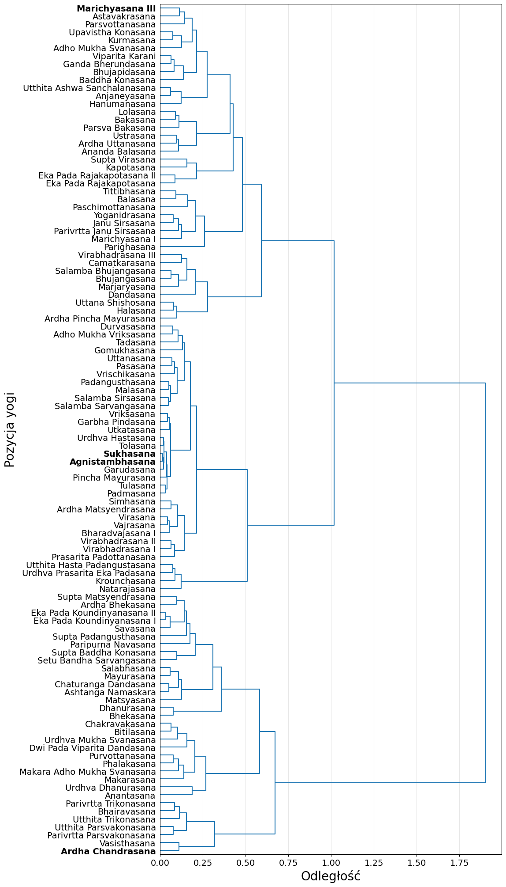
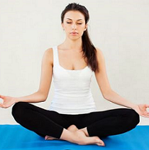
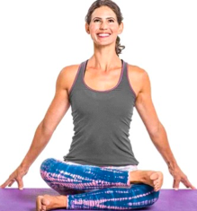
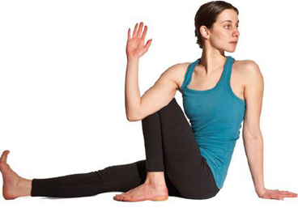
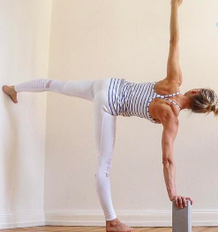

# Yoga Pose Classification
University course project:
> Machine learning -- Ensemble learning strategies comparison on classification quality for imbalanced data

## Similarity Dendrogram (variance of key body coordinates)

## The most similar Yoga poses
> Yoga poses find the closest mean value of the variance of the coordinates of the positions of the points of interest of the body

Sukhasana | Agnistambhasana
:---: | :---:
 |  

## The most varied Yoga poses
> Yoga postures with the outermost mean value of the variance of the coordinate of the position of the body's points of interest

Marichyasana III | Ardha Chandrasana
:---: | :---:
 | 

## Dev
`pip install -r requirements.txt`

`dvc pull`

## Related works
 - [Learning from Imbalanced Data Sets, *Fernández, A. et al.*, 2018](https://www.semanticscholar.org/paper/Learning-from-Imbalanced-Data-Sets-Fern%C3%A1ndez-Garc%C3%ADa/88bcdfd021d935a28f245e178792207881b14794)
 - [Ensembles of Nested Dichotomies with Multiple Subset Evaluation, *Leathart et al.*, 2018](https://arxiv.org/abs/1809.02740)
 - [Posture Recognition Using Ensemble Deep Models under Various Home Environments, *Byeon et al.*, 2020](https://www.mdpi.com/2076-3417/10/4/1287)
